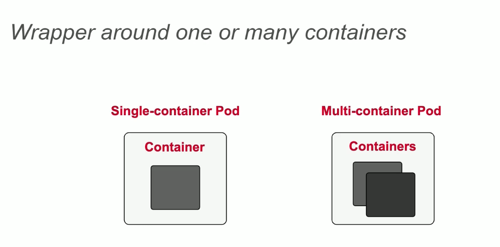
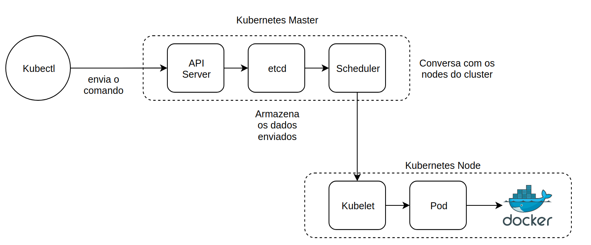
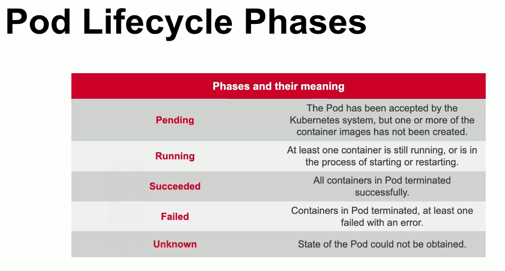

# Módulo 1: Básico

## Kubernetes Object Struture

Tipo | Valores
------ | ------
APIVersion | v1, apps/v1....
Kind | Pod, Deployment, Quota...
Metadata | Name, namespaces, Labels...
Spec | Estado desejado
Status| estado atual

exemplo:

```yaml
apiVersion: v1
kind: Pod
metadata:
  creationTimestamp: null
  labels: 
    run: nginx
  name: nginx
spec:
  containers:
   - image: nginx
     name: nginx
     resources: {}
  dnsPolicy: ClusterFirst
  restartPolicy: Never
status: {}
```

## Criando objetos na linha de comando

Gerenciamento imperativo de objetos

* Rápido mas requer conhecimento detalhado, não há registro de rastreamento:

create: criação de recursos, fornece o tipo e do objeto que deseja criar e o seu nome no final:
```
kubectl create namespace ckad
```
algo semelhante ao run:
```
kubectl run nginx --image=nginx --restart=Never -n ckad
```
podemos editar o comando:
```
kubectl edit pod/nginx -n ckad
```

Gerenciamento declarativo de objetos

* Mais elaborado para mudanças, rastreia as mudanças.
* Cria o arquivo .yaml, escreve o recurso lá e após isso o executa.

```
vim nginx-pod.yaml
kubectl create -f nginx-pod.yaml
kuectl delete pod/nginx
```

Abordagem Híbrida.

* Gerar o arquivo .yaml com o comando kubectl e consegue editar depois.
* Utiliza o comando **--dry-run** para não criar o objeto.
* Utiliza o comando **-o yaml > nomearq.yaml** para criar o yaml.
```
kubectl run nginx --image=nginx --restart=Never --dry-run -o yaml > nginx-pod.yaml
```

## Entendendo Pods


Provávelmente o objeto mais importante.




Fluxo de criação de um pod:



Ciclo de vida de um pod:



## Inspecionando Pods

inspecionando Status de um Pod:

```
kubectl describe pods nginx | grep Status:
...
Status:   Running
```

ou pode usar o comando para ver o atual status no ciclo de vida:
```
kubectl get pods nginx -o yaml
...
status:
  conditions:
  ...
  containerStatuses:
    ...
    state:
      running:
        startedAt: 2019-05-24T16:56:55Z
  phase: Running
```

### Injetando variáveis de ambiente

* Pode injetar via runtime

```yaml
apiVersion: v1
kind: Pod
metadata:
  name: spring-boot-app
spec:
  containers:
   - image: <imagem>
     name: spring-boot-app
     env:
      - name: SPRING_PROFILES_ACTIVE
        value: production
```

### Executar Comandos

* Executar um comando dentro de um container

```yaml
apiVersion: v1
kind: Pod
metadata:
  name: nginx
spec:
  containers:
   - image: nginx
     name: nginx
     args:
      - /bin/sh
      - -c
      - echo hello world
```

### Outros comandos Úteis

* olha os logs do Pod, `-f` para ficar escutando os logs.
```
kubectl logs [-f] <PodName> 
```

* podemos conectar no pod e executar comandos:
```
kubectl exec <PodName> -it -- /bin/sh
```

* Pode consultar um pod e conseguir mais informações:
```
kubectl get po <PodName> -o wide
```

* Acessando Pods(port-forward):
```
kubectl port-forward pod/podName OuterPort:ContainerPort
```

* Quando criar um pod, pode adicionar o `--rm` para deletar o pod quando estiver terminado