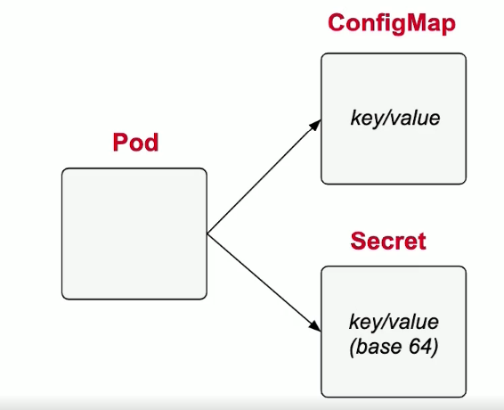
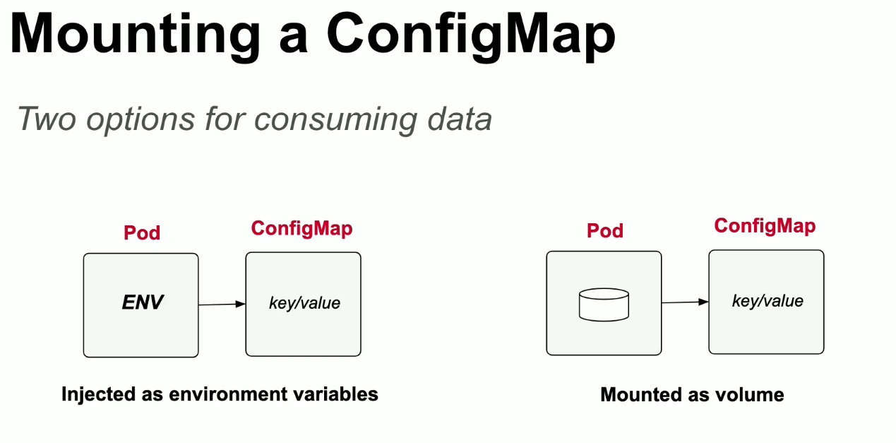
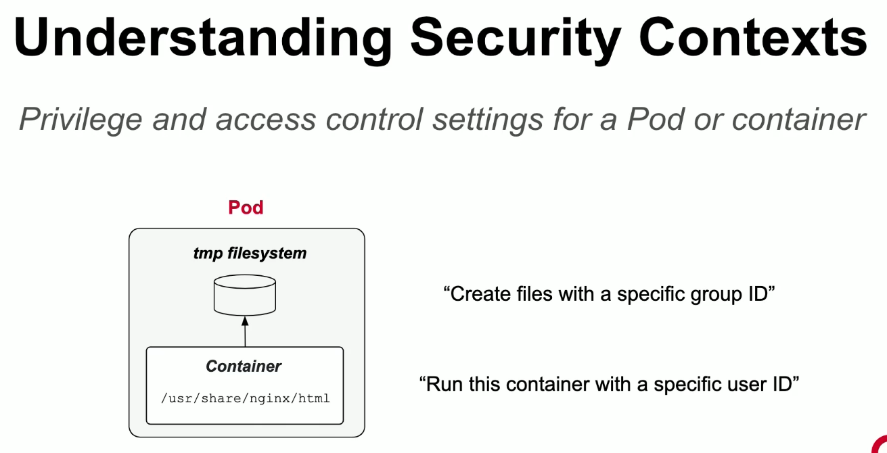
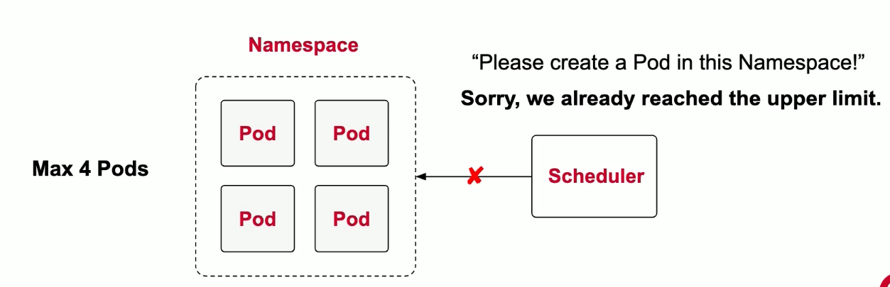

# Módulo 2: Configuração

## Configuração centralizada

Pode utilizar configMaps e Secrets. Diferença entre os dois é que o o Secret encoda(não criptografa) os dados em base64.



## ConfigMaps

* Rápido, Fácil e flexível, pode apontar para fontes diferentes.

Imperativo
```
# Literal values
kubectl create configmap db-config --from-literal=db=staging
# single file with env vars
kubectl create configmap db-config --from-env-file=config.env
# file or directory
kubectl create configmap db-config --from-file=config.txt
```

Declarativo
```yaml
apiVersion: v1
data:
  db: staging
  username: jdoe
kind: ConfigMap
metadata:
  name: db-config
```



Montando ConfigMap como env. var. de um Pod.

```yaml
apiVersion: v1
kind: Pod
metadata:
  name: backend
spec:
  containers:
   - image: nginx
     name: backend
     envFrom:
      - configMapRef:
          name: db-config

```
ou declarando chaves explícitas, caso os nomes forem diferentes:
```yaml
spec:
  containers:
   - image: nginx
     name: backend
     env:
      - name: CONFIG_DB
     valueFrom:
       configMapKeyRef:
          name: db-config
          key: dbConfig
```

Montando ConfigMap como Volume em um Pod.

```yaml
apiVersion: v1
kind: Pod
metadata:
  name: backend
spec:
  containers:
   - image: nginx
     name: backend
     volumeMounts:
      - name: config-volume
        mountPath: /etc/config
  volumes:
   - name: config-volume
     configMap:
       name: db-config
```

**OBS:** Se você montar um ConfigMap como key/value, a key se torna um arquivo e o value seu conteúdo.

## Secrets

* Utilização similar ao ConfigMaps
* Com adição do tipo de secret, nesse caso é `generic`

Imperativo
```
#Literal Values
kubectl create secret generic db-creds --from-literal=pwd=secret
kubectl create secret generic db-creds --from-env-file=creds.env
# file or directory
kubectl create secret generic db-creds --from-file=creds.txt
```

Declarativa:

* Valores devem ser encodados manualmente(base64): `echo -n 'value' | base64`
```yaml
apiVersion: v1
kind: Secret
metadata:
  name: mysecret
type: Opaque
data:
  pwd: <valueInBase64>
```

Montando o Secret como  Env:

```yaml
apiVersion: v1
kind: Pod
metadata:
  name: backend
spec:
  containers:
   - image: nginx
     name: backend
     envFrom:
      - secretRef:
          name: mysecret

```
ou declarando chaves explícitas, caso os nomes forem diferentes:
```yaml
spec:
  containers:
   - image: nginx
     name: backend
     env:
      - name: SECRET
     valueFrom:
       secretKeyRef:
          name: mysecret
          key: secretKey
```

Montando o Secret como Volume:
```yaml
apiVersion: v1
kind: Pod
metadata:
  name: backend
spec:
  containers:
   - image: nginx
     name: backend
     volumeMounts:
      - name: secret-volume
        mountPath: /etc/secret
  volumes:
   - name: secret-volume
     secret:
       secretName: mysecret
```

## Security Contexts



Definindo um Security Context

Pod Level vs Container Level:

```yaml
apiVersion: v1
kind: Pod
metadata:
  name: secured-pod
spec:
  securityContext:  #Pod Level - embaixo do spec, se aplica a todos os containers
    runAsUser: 1000
  containers:
   - securityContext: #Container Level - define de cada container
     runAsGroup: 3000
```

## Definindo limite de recursos

* Define número de Pods, até por namespace.
* Define limite de CPU e Memória, até por namespace.



Criando um **Resource Quota**

Definição no nível do Namespace

```yaml
apiVersion: v1
kind: ResourceQuota
metadata:
  name: app
spec:
  hard:
    pods: "2"
    requests.cpu: "2"
    requests.memory: "500m"
```

Definição no nível do Pod
```yaml
apiVersion: v1
kind: Pod
metadata:
  name: mypod
spec:
  containers:
   - image: nginx
     name: mypod
     resources:    #aqui é onde se define os limites
       requests:
         cpu: "0.5"
         memory: "200m"
```

## Service Accounts

* Provém identidade para processos rodando em um Pod

```yaml
apiVersion: v1
kind: Pod
metadata:
  name: app
spec:
  serviceAccountName: myserviceaccount # o service account
```
