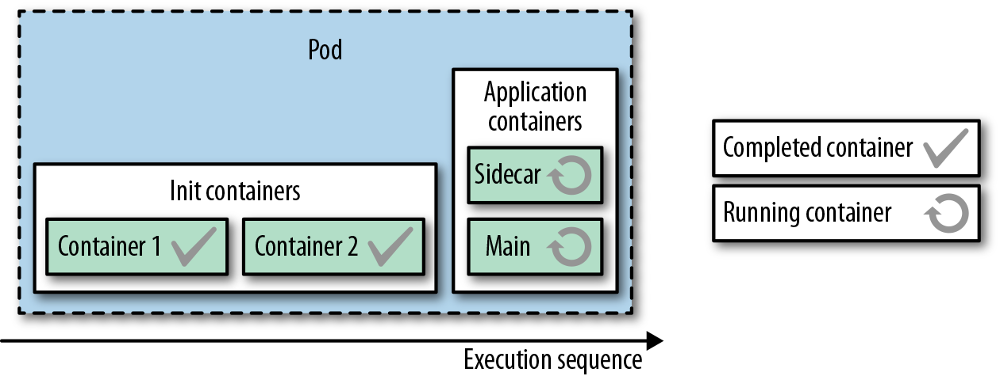
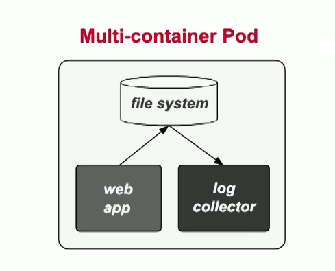
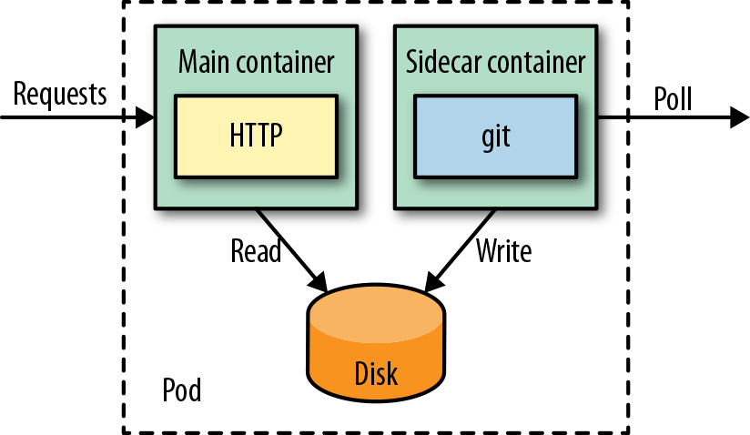

# Modulo 3: Multi-Container Pods

* ciclo de vida e recursos compartilhados.

```yaml
apiVersion: v1
kind: Pod
metadata:
  name: multi-container
spec:
  containers:
   - image: nginx
     name: container1
   - image: nginx
     name: container2
```

Para apontar para um container dentro do Pod, mostre qual container(--container ou -c), ex:

```
kubectl logs multi-container --container=container1
```

## Multi-Container Patterns

*Para o exame*: vai precisar saber no alto nível.(Livro Kubernetes Patterns by O'Reilly)

Patterns:
 * Init Container
 * Sidecar
   * Adapter
   * Ambassador

### Init Container

Lógica de inicialização antes da aplicação principal iniciar.



* eles separam responsabilidades provendo um ciclo de vida para inicialização e conclusão de tarefas diferentes da aplicação principal.
* são esperados que os init containers sejam pequenos, executem rápidos e completem com sucesso.
* devem ser feitos de forma idempotent por questões de restart do Pod.
* eles compartilham recursos, volumes e configs de segurança, então deve prestar atenção, principalmente nos recursos de memória e CPU, onde o limite vai respeitar o maior usado, seja o ini container ou a app.
* eles possuem um esquema diferente para healthcheck, não tem readiness check para os init containers.
* para questões de debug, você pode usar comando `sleep [seconds]` para verificar o init container e saber o que está falhando.

Ex:
```yaml
apiVersion: v1
kind: Pod
metadata:
  name: www
  labels:
    app: www
spec:
  initContainers:
  - name: download
    image: axeclbr/git
    command:                                             
    - git
    - clone
    - https://github.com/mdn/beginner-html-site-scripted
    - /var/lib/data
    volumeMounts:                                        
    - mountPath: /var/lib/data
      name: source
  containers:
  - name: run
    image: docker.io/centos/httpd
    ports:
    - containerPort: 80
    volumeMounts:                                        
    - mountPath: /var/www/html
      name: source
  volumes:                                               
  - emptyDir: {}
    name: source
```

### Sidecar

Melhorar a lógica da aplicação principal.



Pod Sidecar ex:
```yaml
apiVersion: v1
kind: Pod
metadata:
  name: web-app
spec:
  containers:
  - name: app
    image: docker.io/centos/httpd    
    ports:
    - containerPort: 80
    volumeMounts:
    - mountPath: /var/www/html       
      name: git
  - name: poll
    image: axeclbr/git               
    volumeMounts:
    - mountPath: /var/lib/data       
      name: git
    env:
    - name: GIT_REPO
      value: https://github.com/mdn/beginner-html-site-scripted
    command:
    - "sh"
    - "-c"
    - "git clone $(GIT_REPO) . && watch -n 600 git pull"
    workingDir: /var/lib/data
  volumes:
  - emptyDir: {}
    name: git
```



O container principal geralmente é o primeiro que deve ser listado.

### Adapter Pattern

* Especialização do *Sidecar pattern*
* Padroniza e normaliza a saida da aplicação para ser lida por serviços externos.

### Ambassador Pattern

* Especialização do *Sidecar pattern*
* Proxy para a aplicação principal do Pod.(Autentição, Autorização e etc...)
