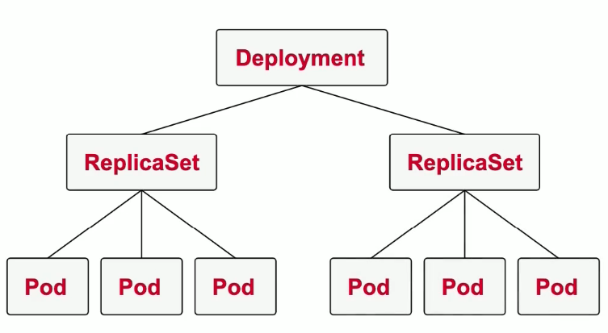
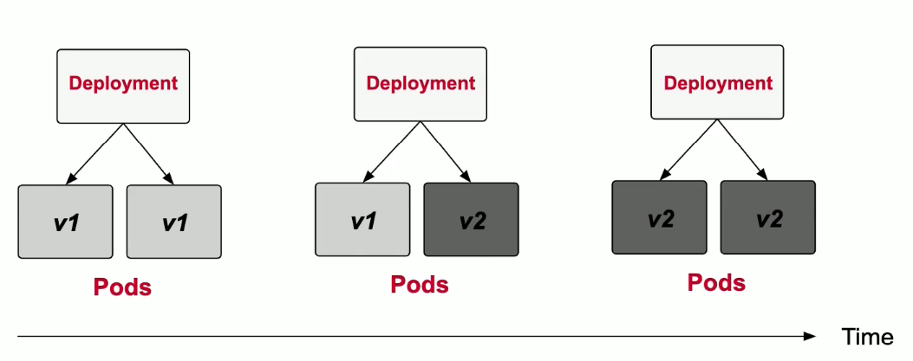

# Modulo 5: Pod Design

### Labels

* São essenciais para consultar, filtrar e organizar os objetos do k8s
* São definidas na seção de `metadata` do k8s do Object Definition

```yaml
apiVersion: v1
kind: POd
metadata:
  name: pod1
  labels:
    tier: backend
    env: prod
    app: miracle
spec:
...
```

Consultar as labels:
```
kubectl get pods --show-labels
```

### Selecionando as labels

Podemos selecionar pelo CLI ou via `spec.selector`

Selecionando via CLI, pode selecionar via *equality-based* e via *set-based*

Exemplo: Onde o tier seja front E o env seja dev
```
kubectl get pods -l(--selector) tier=front,env=dev --show-labels
```

Exemplo: se possui a label version
```
kubectl get pods -l(--selector) version --show-labels
```

Exemplo: Onde o tier for back OU front E o env seja dev
```
kubectl get pods -l(--selector) 'tier in (front,back),env=dev' --show-labels
```

Selecionando via YAML

Equality Exemplo:
```yaml
apiVersion: v1
kind: Service
metadata:
  name: app-service
  ...
spec:
  selector:
    tier: front
    env: dev
```

Equality e set Exemplo:
```yaml
apiVersion: v1
kind: Service
metadata:
  name: app-service
  ...
spec:
  selector:
    matchLabels:
      version: v2.1
    matchExpressions:
     - { key: tier, operator: In, values: [front, back]}
```

Deletando label via CLI
```
kubectl label pod [nome] [label]-(sinal de menos pra remover)
```

### Anotações

* Metadados descritivos sem a habilidade de fazer consultas.
* São definidos na seção `metadata` do k8s Object Definition.

```yaml
apiVersion: v1
kind: Pod
metadata:
  name: my-pod
  annotations:
    commit: 23eefj339
    autor: 'João'
    branch: 'feature/custom'
spec:
...
```

Olhar as anotações via `describe` do k8s

### Deployments

* Adiciona recursos de *Scaling* e *Replication* a um conjunto de Pods.
* Quando se cria um *Deployment*, é criado automáticamente um *ReplicaSet* no qual cuida da replicação.

Labels = usado para adicionar
Selector = usado para consultar as labels
Annotations = usado somente para metadados(fins informativos)



**Criando Deployment**

Comando para executar(run) um deployment está *deprecated*, para criar você não pode especificar o comando `--restart=Never` se não ele cria um Pod.
```
kubectl run my-deploy --image=nginx [--replicas=3]
```

Maneira nova para se criar um Deployment
```
kubectl create deployment my-deploy --image=nginx --dry-run -o yaml > deploy.yaml

nano deploy.yaml

kubectl create -f deploy.yaml
```

Gerar yaml a partir de um deployment:
```
kubectl get deployments nginx --export -o yaml
```

Deployments em YAML
```yaml
apiVersion: v1
kind: Deployment
metadata:
  labels:
    app: my-deploy
  name: my-deploy
spec:
  replicas: 3 # numero de pods para executar
  selector:
    matchLabels:
      app: my-deploy # pods que estejam como essa label
  template: # aqui é como se fosse a definição do Pod, a estrutura é quase igual
    metadata:
      labels:
        app: my-deploy #esse é o label dos Pods que vão executar
    spec:
      containers:
       - image: nginx
         name: nginx
```

Consultar deployments
```
kubectl get deployments
```

procurar por pods que possuam labels em específico.
```
kubectl get pods --selector='run=httpd'
```

adicionar uma label no deployment
```
kubectl label deployment [name] [key=value]
```

remover uma label no deployment
```
kubectl label deployment [name] [key]-
```

ver as labels do deployment
```
kubectl get deployments --show-labels
```

ver o histórico de rollout do deployment
```
kubectl rollout history deployment [name]
```

para fazer um rollout do deployment
```
kubectl rollout undo deployment [name]
```

Estratégias de updates:
* Recreate: mata todos os pods e cria os novos, faz com que tenha uma indisponibilidade temporária.
* RollingUpdate: atualiza um pod de cada vez, garante a disponibilidade.
    * Tem opções para definir o min e o max de pods disponíveis.
        * maxUnavailable: determina o número máximo de pods que são atualizados ao mesmo tempo.
        * maxSurge: número de pod mínimos que rodam acima do limite para garantirem a disponibilidade.

### Replica Set

* Automáticamente criado pelo Deployment, não foi feito para ser modificado.
  *  listar: `kubectl get replicasets`
  *  descrever: `kubectl describe deploy [name]`
  * encontrar a replica: `kubectl describe replicasets [deploy-runtime-name]`

Deployment usa *Rolling Update Strategy*, Vai em cada Pod e o atualiza, um por um.



Desvantagens: Se possuir mudanças significativas que quebram as versões antigas, essa estratégia pode ser problemática.

Podemos chegar o *Rollout History*
```
kubectl rollout history deployments my-deploy
```

Se quiser ver o que exatamente mudou entre os rollouts.
```
kubectl rollout history deployments my-deploy --revision=2
```

Rolling Back

Esse é pra voltar pra versão anterior.
```
kubectl rollout undo deployments [deploy-name]
```

Voltar para algum versão(revision) específico.
```
kubectl rollout undo deployments [deploy-name] --to-revision=<número da revision>
```

ver o status do rollback
```
kubectl rollout status deployments [deploy-name]
```

**Escalando Deployments**

Podemos fazer de dois jeitos:

Manualmente, onde o # é o número desejado:
```
kubectl scale deployments [my-deploy] --replicas=#
```

Ou Automáticamente via porcentagem de recursos utilizados pelos pods(Horizontal Pod Autoscaler). 

Exemplo utilização de CPU ultrapassar os 70%
```
kubectl autoscale deployments [my-deploy] --cpu-percent=70 --min=1 --max=10
``` 

Como consultar
```
kubectl get hpa [my-deploy]
```

## Pods vs. Jobs vs. CronJobs

* Pods: processo "infinito"
* Job: One-time process
* CronJob: Periodic process

**Job:** é completo quando o número específico de conclusões for alcançado, por padrão o número de conclusões é 1.

Criar Jobs

Imperativo(Depreciado):
```
kubectl run counter --image=nginx --restart=OnFailure -- 
/bin/sh -c 'counter=0; while [ $counter -lt 3 ]; do counter=$((counter+1)); echo "$counter"; sleep 3; done;'
```

Declarativo:
```yaml
apiVersion: batch/v1
kind: Job
metadata:
  name: counter
spec:
  completions: 1 ##número de conclusões a ser alcançados
  parallelism: 1 ##se a task deve rodar em paralelo
  backoffLimit: 6 ##quantas vezes nos tentamos até matar o job como falho
  template:
    spec:
      restartPolicy: OnFailure ##Se dar restart no container ou no pod(OnFailure=restart no container dentro do Pod, Never=restart do Pod)
      containers:
       - args:
         - /bin/sh
         - -c
         - ...
        image: nginx
        name: counter
```

Mista:
```
kubectl create job counter --image=nginx --dry-run -o yaml --
/bin/sh -c 'counter=0; while [ $counter -lt 3 ]; do counter=$((counter+1)); echo "$counter" sleep 3; done;' > job.yaml

kubectl create -f job.yaml
```

comandos do job:
```

kubectl get jobs ##lista os jobs

kubectl get pods ##olhar os pods relacionados ao job

```

**CronJob:** tarefa que é executada em uma agenda específica

`spec.schedule: "0 * * * *"`

Criar CronJobs

Imperativo(Depreciado):
```
kubectl run counter --image=nginx --restart=OnFailure --schedule="*/1 * * * *" ... 
```

Declarativo:
```yaml
apiVersion: batch/v1beta1
kind: CronJob
metadata:
  name: counter
spec:
  schedule: "*/1 * * * *"
  jobTemplate:
    spec:
      template:
        spec:
          restartPolicy: Never ##Se dar restart no container ou no pod(OnFailure=restart no container dentro do Pod, Never=restart do Pod)
          containers:
          - args:
            - /bin/sh
            - -c
            - ...
            image: nginx
            name: counter
```

comandos do job:

```

kubectl get cronjobs ##lista os jobs

kubectl get jobs --watch ##olha os jobs executando na agenda

```