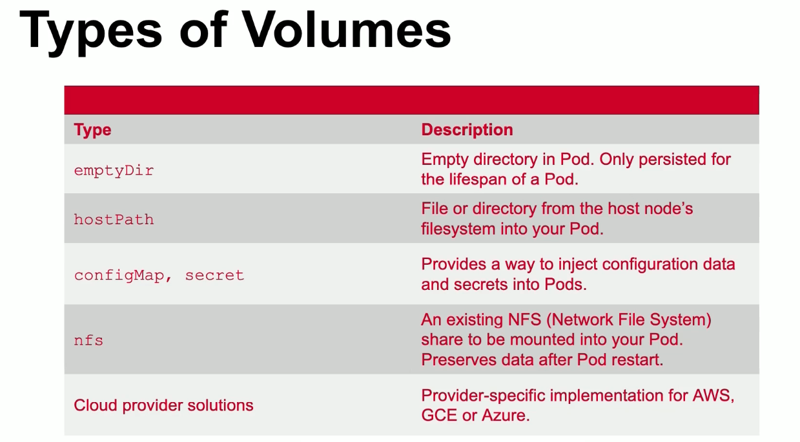
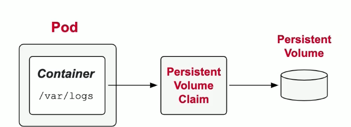

# Modulo 8: State Persistence

## Volumes

Persiste os dados que ultrapassam os restarts do container



Criando um Volume.

Declarativo:
```yaml

apiVersion: v1
kind: Pod
metadata:
  name: my-container
spec:
  volumes:               ##Define o volume e seu tipo
   - name: logs-volume
     emptyDir: {}
  containers:
   - image: nginx
     name: my-container
     volumeMounts:            ##Monta o volume definido em um caminho
      - mountPath: /var/logs
        name: logs-volume
```

## PersistentVolumes

Representam um armazenamento dentro do cluster do k8s. Sobrevivem ate se o container, Pod, Node ou k8s reiniciar



Etapas para a criação do PersistentVolume

1. Criando PV:
```yaml
apiVersion: v1
kind: PersistentVolume
metadata:
  name: pv
spec:
  capacity:            #Define a capacidade de armazenamento
    storage: 512m
  accessModes:         # Define quantos nodes podem acessar/escrever?
   - ReadWriteOnce
  storageClassName: shared
  hostPath:            # tipo do persistência
    path: /data/config
```

2. Criando PVC:
```yaml
apiVersion: v1
kind: PersistentVolumeClaim
metadata:
  name: pvc
spec:
  accessModes:
   - ReadWriteMany
  resources:
    requests:
      storage: 256m        #Define o quanto mais consumir do PV
  storageClassName: shared #mapeia para o PV que é mais similar
```

2. Montando a Claim:
```yaml
apiVersion: v1
kind: Pod
metadata:
  name: app
spec:
  volumes:
   - name: configpvc
     persistentVolumeClaim:
       claimName: pvc      #Referência a qual claim deve usar
  containers:
   - image: nginx
     name: app
     volumeMounts:        #Monta o volume em um path dentro do container
      - mountPath: "/data/app/config"
        name: configpvc
```