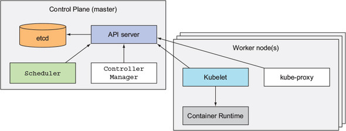

# Capitulo 1: Intro

* Kubernetes significa piloto ou timonerio(aquele de governa o timão nas embarcações)

* Abstrai toda a infraestrutura em um único recurso computacional, permite executar deploys sem saber os detalhes da infraestrutura. Ele cuida da alocação, onde será deployado, o habilita e assegura a sua comunicação e proteção contra falhas.

* Aplicações Monolíticas só podem ser escaláveis até certo nível, além de possuir acoplamento das funcionalidades, e também por processos e software, onde é um único pacote a ser executado. Isso causa problemas de distribuição dos pacotes, organizzação e distribuição de vários times trabalhando no mesmo pacote, e também a escabilidade da aplicação e componentes(como banco de dados) que podem ser um problema. A quebra das aplicações monolíticas em microserviços é o caminho para resolução desses problemas e o kubernetes entra para gerenciar de forma fácil todos esses componentes micros.

* K8s(Kubernetes) utiliza a tecnologia de containers para isolar as aplicções em execução.

* Kubernetes de originou de sistemas como Borg e Omega que o Google criou e utilizou internamente por mais de uma década e deixou em segredo, em 2014 o Kubernetes foi anunciado e disponibilizado ao mundo.

## Funcionalidades

* Manage Containers
* Service discovery
* Load Balacing
* Scaling
* Self-healing apps
* Leader election

## Entendendo a arquitetura do K8s

São constituído de um ou mais nós onde temos dois tipos:

* Master: no qual possui o K8s Control Plane que controla e gerencia o k8s
* Worker: onde as aplicações são executadas.

### Control Plane

Consiste em múltiplos componentes:

* K8s API Server: no qual você e outro componentes do Control Plane de comunicam
* Scheduler: agenda a sua aplicação(designa a sua app pra algum Worker Node que possua recursos/caracteristicas para executá-la)
* Controller Manager: Faz funções do Cluster, como: replicação de componentes, mantém atualização dos Workers, e lida com falhas dos Nós e etc.
* Etcd: um banco de dados confiável e distribuído que armazena toda a configuração do Cluster.

OBS: O Master(junto com esses componentes) só mantém o estado do Cluster, eles não rodam as apps. Isso é feito pelos Workers.

## Vantagens do k8s

* Distribuição simplificada da app: k8s gerencia todos os aspectos de distribuição e execucação da app dentro do cluster automaticamente.
* Melhor utilização de hardware: O k8s sempre vai escolher o nó mais apropriado para a sua aplicação, baseado nos requisitos e na viabilidade de recursos nos nós.
* Health-check e self-healing: Pode ser feito configurações para o k8s monitorar a saúde da sua app, e se não não estiver saudavel o k8s pode matar e agendar ela em outro nó para resolver, também em falhas de nós indisponíveis o k8s vai remanegar todas as apps desse nó em outros.
* Auto-scaling: Pode se configurar no k8s ele fazer o auto-scaling baseado em métricas de utilização de CPU, Memória em tempo real, sem intervenção manual para isso.
